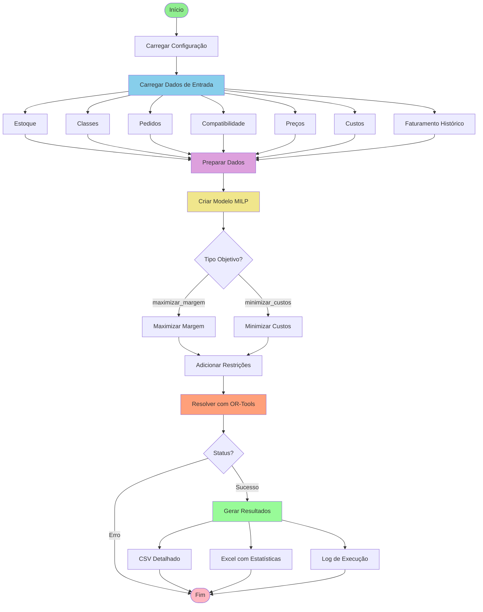
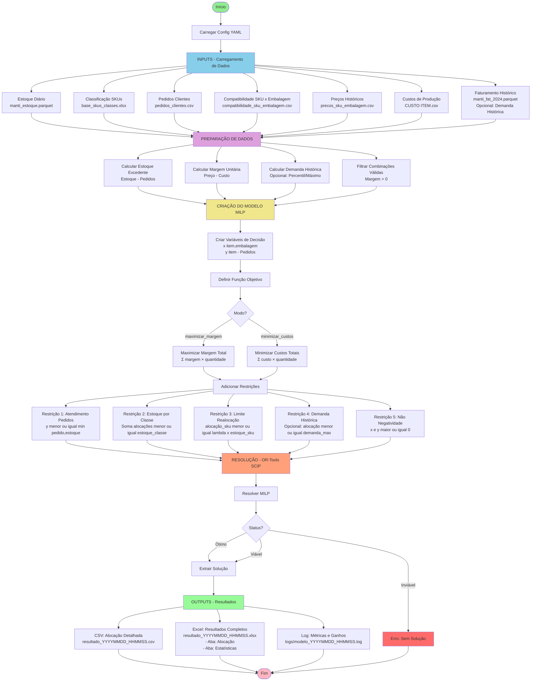

# Fluxo do Modelo de Otimização de Mix Diário

## Diagrama de Fluxo Simplificado

## Diagrama de Fluxo Detalhado

## Descrição dos Componentes

### INPUTS (Entradas)

1. **Estoque Diário** (`manti_estoque.parquet`)
   - Estoque disponível por SKU em uma data específica
   - Filtrado por tipo de estoque (ex: "DISPONIVEL PARA VENDA")

2. **Classificação SKUs** (`base_skus_classes.xlsx`)
   - Mapeamento de SKU → Classe de Produto
   - Define agrupamentos para realocação

3. **Pedidos Clientes** (`pedidos_clientes.csv`)
   - Demandas específicas por SKU
   - Podem ser atendidos parcialmente

4. **Compatibilidade** (`compatibilidade_sku_embalagem.csv`)
   - Combinações viáveis de SKU x Embalagem
   - Histórica (vendidas) + Técnica (viáveis)

5. **Preços Históricos** (`precos_sku_embalagem.csv`)
   - Preço médio por combinação (SKU, Embalagem)
   - Calculado a partir do faturamento histórico

6. **Custos de Produção** (`CUSTO ITEM.csv`)
   - Custo de produção por SKU
   - Obtido do sistema de custeio

7. **Faturamento Histórico** (`manti_fat_2024.parquet`)
   - Opcional: usado para calcular limites de demanda histórica
   - Suporta granularidade mensal/semanal/diária

### PROCESSAMENTO

1. **Preparação de Dados**
   - Merge de todos os datasets
   - Cálculo de estoque excedente (estoque - pedidos)
   - Cálculo de margem unitária (preço - custo)
   - Cálculo de demanda histórica (se habilitado)
   - Filtragem de combinações válidas

2. **Criação do Modelo MILP**
   - Variáveis de decisão: `x[item, embalagem]` e `y[item]`
   - Função objetivo: Maximizar margem OU Minimizar custos
   - Restrições operacionais e comerciais

3. **Resolução**
   - OR-Tools com solver SCIP
   - Busca solução ótima ou viável
   - Limite de tempo configurável

### OUTPUTS (Saídas)

1. **CSV Detalhado** (`resultado_YYYYMMDD_HHMMSS.csv`)
   - Alocação ótima por combinação (SKU, Embalagem)
   - Separação entre PEDIDO e EXCEDENTE
   - Métricas de realocação

2. **Excel Completo** (`resultado_YYYYMMDD_HHMMSS.xlsx`)
   - Aba "Alocação": Detalhamento completo
   - Aba "Estatísticas": Resumo de métricas, ganhos, tempos

3. **Log Detalhado** (`logs/modelo_YYYYMMDD_HHMMSS.log`)
   - Processo completo de execução
   - Métricas de ganho (baseline vs otimizado)
   - Informações de debug

## Fluxo de Decisão

### Modo de Operação

O modelo pode operar em diferentes modos conforme configuração:

- **Atender Pedidos**: `true` = prioriza pedidos, otimiza excedente | `false` = ignora pedidos
- **Usar Apenas Excedente**: `true` = otimiza só excedente | `false` = otimiza estoque total
- **Tipo Objetivo**: `maximizar_margem` (padrão) | `minimizar_custos` (desova de estoque)

### Restrições Opcionais

- **Demanda Histórica**: Limita alocação baseada em padrões históricos de venda
  - Granularidade: Mensal (M), Semanal (S), Diária (D)
  - Método: Percentil ou Máximo Histórico

